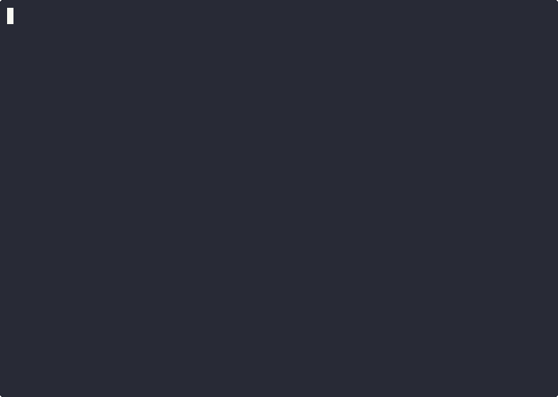

# Gendox — End documentation drift for good

[](https://github.com/alonsovm44/gendox/releases)
[](https://opensource.org/licenses/MIT)
[]()
[]()

[]()

| Basic Workflow | Interactive Chat | Auto-Update |
|:---:|:---:|:---:|
|  |  |  |
## Why Gendox matters to YOU NOW.

Docs rot fast, and updating them manually kills focus.  
Run `gendox auto` — your documentation evolves with your code in real time, always accurate, never stale.

## Try it now (safe copy-paste)
> Note: I get that you may be uncomfortable with piping unknown remote scripts into a shell, you can audit the installer `installer.sh/.ps1` yourself and see it is safe. Otherwise you can use `shellcheck installer.sh`.

## Try Gendox in 1 Minute (Instant Onboarding)

### 1️⃣ Docker (Recommended)
No installation required — just clone and run:

```bash
git clone https://github.com/alonsovm44/gendox.git
cd gendox
docker compose up -d                 # Builds Gendox + Ollama
docker compose run gendox init       # Initialize project
docker compose run gendox update     # Generate docs
```
## Quick Install (recommended):

**Linux / macOS:**
Download installer, inspect, run:
```bash
# Download
curl -fsSL https://raw.githubusercontent.com/alonsovm44/gendox/master/installer.sh | bash

```
For windows
```bash
#download and install
irm https://raw.githubusercontent.com/alonsovm44/docgen/master/installer.ps1 | iex
```

## Interactive chat
Good for onboarding.
```bash
docgen query "how does auth work in this project?"
# or you can open a chat session
docgen query --chat
# or open a project-specific session:
docgen query --chat --project .  # reads .docgen/docs and project context
```
This launches a terminal chat where the AI answers questions about the documented codebase and links back to generated pages.

## Core concepts (short)
- Docs-as-Code: generated Markdown lives next to source, tracked in `.docgen/`.
- Incremental builds: file-level hashing avoids re-generating unchanged docs.
- Context-aware (RAG): dependency analysis provides the LLM with the right context for complex APIs.

## Docfile — example (store the blueprint for Gendox)
```Docfile
Track:
    main.cpp
    src/
Ignore:
    src/secret.cpp

Style:
    -dont use emojis
    -be professional
    -be concise
```

## Common commands (copy-paste)
- Initialize project:
  `gendox init`

- Watch for changes, update docs in real time as you work:
 ` gendox auto`

- Query the AI bout the codebase, good for onboarding
`gendox query "query string"`

- Track files/directories:
  `gendox track <path>`

- Update docs (generate):
  `gendox update`

- Check status (like Git status):
  `gendox status`

- Generate project summary:
 ` gendox summary`

- Dependency graph (DOT):
  `gendox graph`

- Verify docs are up-to-date (use in CI):
  `gendox validate`

- Clean deleted/untracked docs:
  `gendox clean`

- Reset docgen repo (asks confirmation):
  `gendox reboot`

## Config & connection
Run `gendox config` to manage the backend and model:
```bash
gendox config mode local    # default (Ollama)
gendox config model qwen2.5-coder:7b
gendox config mode cloud
gendox config protocol openai
gendox config key <YOUR_API_KEY>
gendox config check           # verify connection
```

Configuration keys quick reference

| Key | Description | Example |
|---|---:|---|
| mode | Backend mode | `local` / `cloud` |
| protocol | API format | `openai` / `google` / `simple` |
| key | Cloud API key | `sk-...` |
| model | Model identifier | `gpt-4o`, `qwen2.5-coder:7b` |


## FAQ (short)
Q: Is gendox rewriting my code?  
A: No. gendox reads source and generates Markdown docs. It never mutates your source files unless you explicitly run commands that write generated artifacts.

Q: Is it deterministic?  
A: gendox hashes context and caches outputs. Determinism depends on model behavior. For full reproducibility, pin model + prompt versions and use the cache/artifact files. gendox reuses docs so they are not rewritten from scratch everytime a tracked file is modified. It is incremental.

## Contributing & support
- Please open issues for bugs/feature requests and PRs for examples and docs. See CONTRIBUTING.md and SECURITY.md for reporting sensitive issues.

## License
- MIT — see LICENSE file.